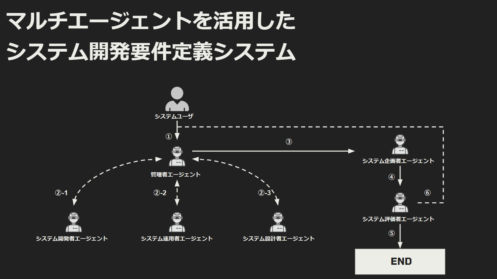

## multi_agentの概要

multi_agentとして、LangChainを使用して複数のエージェントが協力してシステム開発の要件を検討するためのノートブックです。

## multi_agent_supervisor.ipynbの処理フロー

以下の図は、`multi_agent_supervisor.ipynb` の処理フローを示しています。

## multi_agent_supervisor.ipynbの処理詳細説明

### 想定動作フロー

1. 管理者が、ユーザから開発したいシステム内容を受け取る
2. 管理者が【開発者・運用者・設計者】の中から選択し、システム要件を検討させる
   - ※管理者がOKを出すまで繰り返す
3. 充分に要件検討の材料が集まったら企画者へこれまでの内容を入力として渡す
4. システム開発要件の取りまとめを実施、評価者に渡す
5. 企画者が取りまとめた内容を評価者が評価し、評価理由を添えて出力する
6. 評価者がNGを出した場合、再度管理者にタスクを実行させる